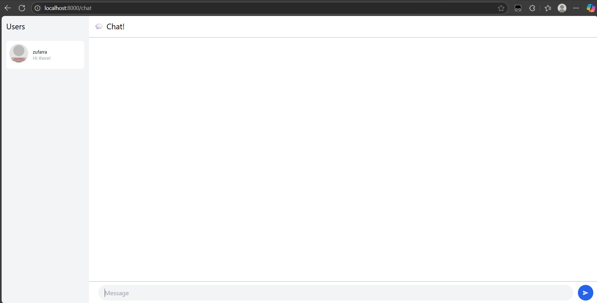
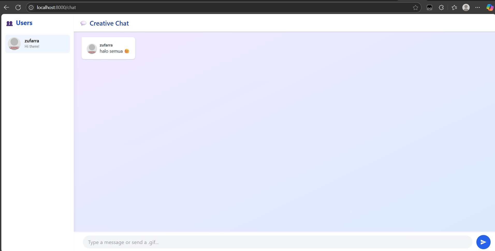

# Reflection Tutorial Modul 10

**Zufar Romli Amri**  
**NPM**: 2306202694  
**Kelas**: A

---

### 3.1 Original code.

---

### 3.2 Be creative!

Pada implementasi ini, saya menambahkan sentuhan kreativitas pada antarmuka aplikasi chat berbasis Yew dengan mengubah tampilan dan pengalaman pengguna menjadi lebih menarik dan modern. Pertama, saya menggunakan latar belakang gradasi warna ungu ke biru (bg-gradient-to-br from-purple-100 to-blue-100) untuk menciptakan nuansa visual yang lebih hidup dan menyenangkan. Bagian daftar pengguna diberikan tampilan elegan dengan latar putih dan efek bayangan, serta setiap pengguna ditampilkan dengan avatar bulat dari Dicebear dan sapaan kecil yang bersifat ramah.

Di bagian utama chat, saya mendesain sistem chat bubble yang tampil berbeda tergantung siapa pengirimnya—pesan dari pengguna sendiri akan tampil di sisi kanan dengan warna biru muda, sedangkan pesan dari pengguna lain tampil di sisi kiri dengan latar putih. Saya juga menambahkan dukungan untuk pesan berupa gambar GIF, sehingga ketika pengguna mengirim link berakhiran .gif, gambar akan ditampilkan langsung di dalam bubble. Sebagai tambahan, saya menyisipkan fitur pengganti teks emotikon seperti :smile: menjadi emoji asli seperti 😊, agar interaksi terasa lebih ekspresif dan menyenangkan.

Input form di bagian bawah juga diperindah dengan gaya modern, termasuk focus ring biru dan tombol kirim berbentuk bulat dengan ikon panah, memberikan kesan intuitif dan responsif. Semua elemen ini bertujuan untuk menunjukkan bahwa kreativitas dalam pemrograman tidak hanya soal logika, tetapi juga bagaimana kita menciptakan pengalaman pengguna yang estetis, humanis, dan menyenangkan.